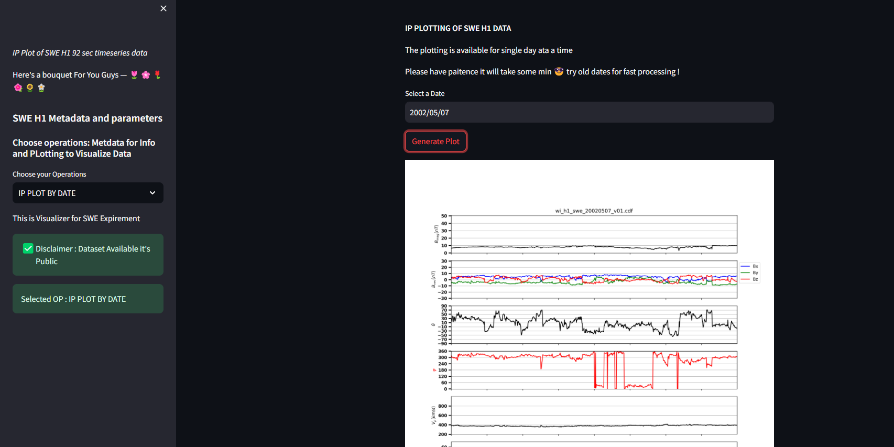

# WIND Data Analysis and Visualization Project

## Overview

This project focuses on developing and maintaining Python scripts that utilize Pyspedas for efficient data extraction from the WIND API. The primary aim is to clean, analyze, and visualize multi-year datasets from the WIND Database, facilitating easier and more effective analysis for the research department.

## Features

- **Data Extraction**: Leveraged Pyspedas to extract data efficiently from the WIND API.
- **Exploratory Data Analysis (EDA)**: Conducted EDA on multi-year datasets to identify key insights and trends.
- **Scientific Calculations**: Performed calculations to derive new parameters from WIND data, optimizing logic and time complexity.
- **Data Visualization**: Created and optimized IP plots and visualizations with Matplotlib to effectively present analytical findings.
- **Version Control**: Managed codebase and version control on GitHub, facilitating collaboration and maintaining project structure.
- **Research and Review**: Researched and reviewed relevant literature on CMEs and data analysis techniques to support project development.

## Impact

This project has significantly aided the research department in visualizing years of data, making it easier for them to analyze and derive meaningful insights. The optimized scripts and visualizations have streamlined the data analysis process, saving time and improving the accuracy of their research.

## Output 



## Installation

1. Clone the repository:
   ```bash
   git clone https://github.com/Tobaisfire/IPPLOT_STREAM.git
   cd IPPLOT_STREAM
   ```

2. Create and activate a virtual environment:
   ```bash
   python3 -m venv venv
   source venv/bin/activate  # On Windows use `venv\Scripts\activate`
   ```

3. Install the required packages:
   ```bash
   pip install -r requirements.txt
   ```

## Usage

1. **IP PLOT STREAM**: Run the script to extract data from the WIND API:
   ```bash
   python -m streamlit run  app_stream.py
   ```


## Contributing

We welcome contributions to enhance the functionality and features of this project. Please follow these steps to contribute:

1. Fork the repository.
2. Create a new branch: `git checkout -b feature-branch`
3. Make your changes and commit them: `git commit -m 'Add new feature'`
4. Push to the branch: `git push origin feature-branch`
5. Submit a pull request.

## License

This project is licensed under the MIT License. See the [LICENSE](LICENSE) file for details.

## Acknowledgements

- Special thanks to the WIND mission team for providing the datasets.
- Thanks to the contributors and the open-source community for their valuable inputs.

## Contact

<!-- For any questions or suggestions, please contact [your-email@example.com](mailto:your-email@example.com). -->

---

Developed and maintained by [Your Name](https://github.com/yourusername)